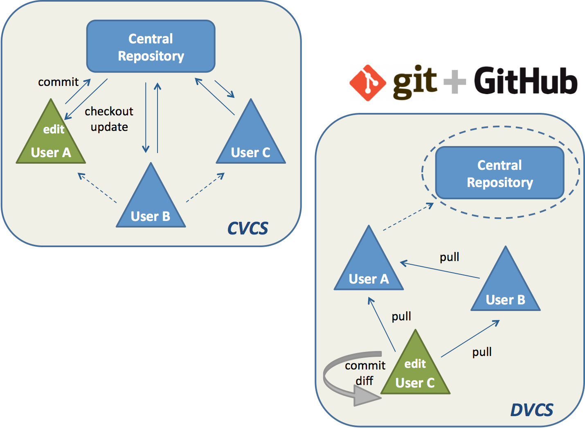

---

What ist git?
===============

* the most widely used modern version control system in the world today
* originally developed in 2005 by Linus Torvalds

* Distributed Version Control System (DVCS)

---

What is DVCS?
-------------

* Centralized version control systems (CVCS) focuses on synchronizing, tracking, and backing up files.
* Distributed version control systems (DVCS) focuses on sharing changes; every change has a guid or unique id.
* Recording/downloading and applying a change are separate steps (in a centralized system, they happen together).
* Distributed systems have no forced structure. You can create “centrally administered” locations or keep everyone as peers.
* DVCS new terminology
    * Pushes refer to sending a change to another repository (permissions may be required)
    * Pulls refer to grabbing a change from a repository

--- 



---


---


Advantages
----------------

* Everyone has their own local sandbox.
* git works offline.
* git is fast.
* Branching and merging is easy.


---

Disadvantages
--------------

* You still need a backup.
* You still want a machine to push changes.
* There’s not really a “latest version”
* There aren’t really revision numbers.

--- 

git Basics
===========

---


getting help
-------------- 

```shell

$ git help log
$ git log --help


``` 

setting up git user
--------------------

```shell

$ git config --global user.name "Your Name Comes Here"
$ git config --global user.email you@yourdomain.example.com

```

(not your git credentials)  

---

init new git repository
-------------------------

```shell

$ cd /path/to/repo
$ git init
Initialisierte leeres Git-Repository in /path/to/repo/.git/

```

---

check status 
-----------------

```shell

$ git status
Auf Branch master
Ihr Branch ist auf dem selben Stand wie 'origin/master'.
...

```

---

add file(s) to git
-----------------

```shell

$ touch file1 file2 file3
$ # git add . 
$ # git add *
$ git add file1 file2 file3
$ git status

Auf Branch master

Initialer Commit

zum Commit vorgemerkte Änderungen:
  (benutzen Sie "git rm --cached <Datei>..." zum Entfernen aus der Staging-Area)

	neue Datei:     file1
    neue Datei:     file2
    neue Datei:     file3

```

---

remove from staging area
-------------------------

```shell

$ git rm --cached file1
rm 'file1' 

$ ls
file1 file2 file3

```
--- 

commiting changes 
------------------

add commit message 

```shell

$ git commit -m "my commit message"
[master (Basis-Commit) 3074e91] my commit message
 3 files changed, 0 insertions(+), 0 deletions(-)
 create mode 100644 file1
 create mode 100644 file2
 create mode 100644 file3

```

---

add commit message in editor

 ```shell
$ git config --global core.editor nano
$ #or ($VISUAL or $EDITOR)
$ git config core.editor  
nano
$ git commit

```

---

History
==========

---

commit ids
------------

```
$ git log
commit 933c51027acf9956c6e02950e92af72e277200b1
Author: Florian Schimmer <florian.schimmer@conplement.de>
...
```

tags 
------


---


HEAD versions 
---------------

HEAD - 
HEAD^ - parent of head
HEAD^^ - grandparent of head
HEAD~4 - great-great grandparent of HEAD

---

Tags
----------

---

Branching and Merging
=====================

--- 

create branch

```shell

$ git branch branch1
$ git branch  
  branch1
* master
$ git checkout branch1
$ git branch
* branch1
  master

```

---

create branch and checkout 
---------------------------

```shell

$ git checkout -b branch2
Zu neuem Branch 'branch2' gewechselt
$ git branch
  branch1
* branch2
  master
```
---

delete local branch 
--------------------

```shell 

$ git branch -d branch1
$ git branch
* branch2
  master

```
---

rename branch
--------------

```shell

$ git branch -m branch2 branch1
$ git branch 
* branch1
  master
```

----

merging branches 
------------------

```
$ git checkout master # switch to master branch
$ git merge branch1
Aktualisiere 933c510..c4c9e2f
Fast-forward
 file1 | 0
 1 file changed, 0 insertions(+), 0 deletions(-)
 create mode 100644 file1
```

---

Exploring history 
==================

---

print commits
-------------------

```shell
$ git log
commit 933c51027acf9956c6e02950e92af72e277200b1
Author: Florian Schimmer <florian.schimmer@conplement.de>
Date:   Thu Sep 14 16:20:30 2017 +0200

    initial commit
```
---

print more informations about a commit 
--------------------------------------

```shell
$ git show 933c51027acf9956c6e02950e92af72e277200b1
commit 933c51027acf9956c6e02950e92af72e277200b1
Author: Florian Schimmer <florian.schimmer@conplement.de>
Date:   Thu Sep 14 16:20:30 2017 +0200

    initial commit

diff --git a/myfile.txt b/myfile.txt
new file mode 100644
index 0000000..e69de29
```
---


---

Work with remotes
===================

---

clone repository 
-----------------

```shell

$ git clone https://path/to/git-repository.git
$ ls
git-repository

```

---

add user-credentials 
--------------------

** either **

add ssh-key to repository (webinterace)

** or **

```
git config [--global] credential.helper "<helper> [<options>]"
```

---

add remote and push local repository 
--------------------------------------

```shell

$ git remote add origin https://path/to/git-repository.git
$ git push -u origin master 

```
---

get information about remotes 
--------------------------------

```shell
$ git remote 
origin
$ git config --get remote.origin.url
|https://path/to/git-repository.git
$ git remote show origin
* Remote-Repository origin
  URL zum Abholen: https://path/to/git-repository.git
  URL zum Versenden: https://path/to/git-repository.git
...
```
---

actualize remote(s)
------------------------------

```
$ git remote update
Fordere an von origin
Fordere an von remote2
$ git fetch --all
Fordere an von origin
Fordere an von remote2
$ git fetch 
Fordere an von origin
```
---

avoid using 'git pull'
----------------------

git pull will update and merge any remote changes of the current branch you're on.

instead use

```
$ git fetch
$ git diff
$ git merge
```

---


